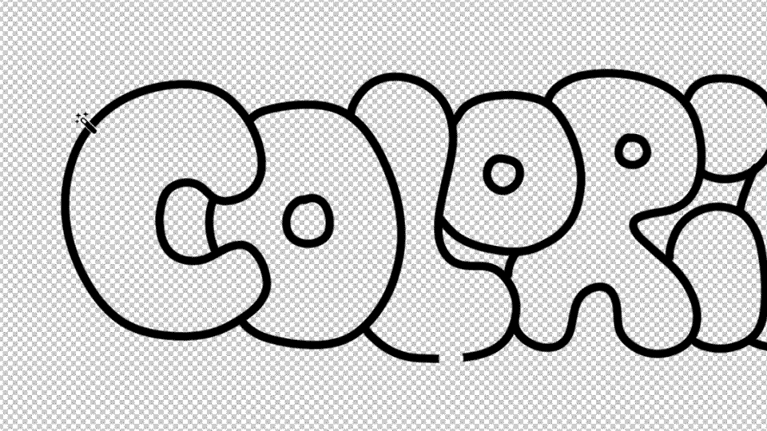

# Coloriage

**Fast coloring workflow for Photoshop**

Automates the flatting process for line art coloring. 



---

## What it does

Coloring in Photoshop can be tedious, especially when you want clean edges without jagged white borders. **Coloriage** automates the entire flatting workflow in a single click:

1. **Expands** your selection by 2 pixels
2. **Creates** a new layer
3. **Fills** with your foreground color
4. **Places** the layer below the original
5. **Merges** while keeping the original layer name

**Bonus:** The selection stays active, so you can run the script multiple times to expand further if needed.

---

## Installation

### Step 1: Download

Download the latest release from the [Releases page](https://github.com/charlimars/coloriage/releases).

### Step 2: Install the script

**Mac:**
```
/Applications/Adobe Photoshop [version]/Presets/Scripts/
```

**Windows:**
```
C:\Program Files\Adobe\Adobe Photoshop [version]\Presets\Scripts\
```

Copy `Coloriage.jsx` into this folder and restart Photoshop.

### Step 3: Access the script

The script will appear in: **File > Scripts > Coloriage**

---

## Setting up a keyboard shortcut (recommended)

For maximum speed, create a keyboard shortcut via Actions:

1. Open the **Actions panel** (Window > Actions or `Alt+F9`)
2. Create a new action set (folder icon)
3. Create a new action (`+` icon)
   - Name: "Coloriage"
   - Assign a function key (e.g., `F5`)
4. Click **Record**
5. Go to **File > Scripts > Browse...** and select `Coloriage.jsx`
6. Stop recording (square icon)

Now you can run Coloriage with your chosen keyboard shortcut!

Detailed installation guides (French + English) are included in the download.

---

## Usage

1. **Select** an area on your line art layer (using Lasso, Magic Wand, or any selection tool)
2. **Run** the script (File > Scripts > Coloriage or your keyboard shortcut)
3. **Done!** Your selection is filled and properly layered

The selection remains active, allowing you to run the script again for additional 2-pixel expansions.

---

## Compatibility

- **Photoshop CC 2020** or higher
- **Tested on:** Photoshop 2020 and 2024
- **Platforms:** macOS and Windows

---

## Use Cases

- **Character rigging** for After Effects puppets
- **Line art flatting** for illustration
- **Comic/manga coloring**
- **Animation preparation**
- Any workflow requiring clean color fills under line art

---

## What's included

- `Coloriage.jsx` - The Photoshop script
- Installation guides (French + English PDF)
- Keyboard shortcut setup instructions

---

## License

This script is **100% free** with no limitations.

If you find it useful, feel free to:
- ⭐ Star this repository
- 🔗 Share it with other creators
- 🌐 Visit [charlie-mars.com](https://www.charlie-mars.com)
- 📸 Follow me on [Instagram](https://www.instagram.com/charlimars/)

---

## Issues & Feedback

Found a bug or have a suggestion? Open an [issue](https://github.com/charlimars/coloriage/issues) or reach out!

---

## Author

**Charlie Mars** - Director, illustrator, animator

